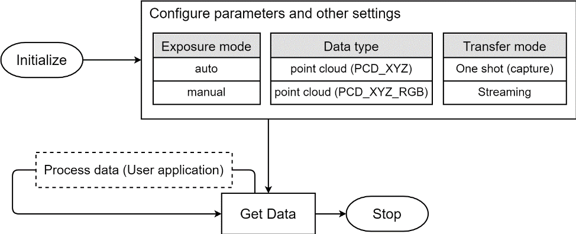

# 3DSLiM SDK User Manual

## Introduction

This user manual is intended for users who want to quickly familiarize themselves with 3DSLiM SDK. OPUS provides both a set of API functions (3DSLiM API) and a graphical user interface (Apollo Visualizer) . 3DSLiM SDK supports two ways of outputting point cloud data. One way is to capture a point cloud, it’s slow but guarantee the point cloud is generated in the moment you call the function. The other way is to stream point clouds, it’s fast but you might get the previous data in the buffer. Please refer to the sample code for more detail.

Notice: If your 3D camera module is mounted with an extra IR camera and connected with another USB cable, note that we do not provide sample code for accessing that IR camera. We suggest that you use 3rd party library (ex. OpenCV) to access it.

## Supported platform and environment

- OS: Windows 10 x64, Ubuntu 18.04 LTS
- Language: C/C++ with .h and .lib (.a)
- Compile scenario: VS2017, release, x64 (Windows), g++ (Ubuntu)

## Overview

<!--There’s one more data type called IR_IMG for only receiving IR images, but it’s only useful for testing if the IR camera is working properly-->

## Installation

TBD

## Update History

### 0.0.5.3: @20200526, SDK: V00.905.03

1. Update SDK to be compatible with both Windows 10 x64 and Ubuntu 18.04 LTS

 

### V 0.0.5.2: @20200521, SDK: V00.905.02

1. Update SDK to be compatible with new calibration method

 

### V 0.0.5.1: @20200507, SDK: V00.905.01

1. Windows version of SDK (Ubuntu 18.04 LTS is confirming compatibility, should be updated soon)

 

### V 0.0.5: @20200415, SDK: V00.905.01

1. Add support for PCD_XYZ_RGB.
2. Add support for Ubuntu 18.04 LTS; however, compatibility of Windows version of SDK is still confirming.

 

### V 0.0.4: @20200409, SDK: V00.904.02

1. Modify depth mapping range: use min_z_cutoff and max_z_cutoff to control the mapping range of depth-map : maps min_z_cutoff --> max_z_cutoff to 65535 -->0. 

   

### V 0.0.3: @20200406, SDK: V00.904.01

1. Add depth map data pointer ”p_depth” to output api.
2. Add relative sample code to explain how to use p_depth.
3. Change default value of resampling_factor.